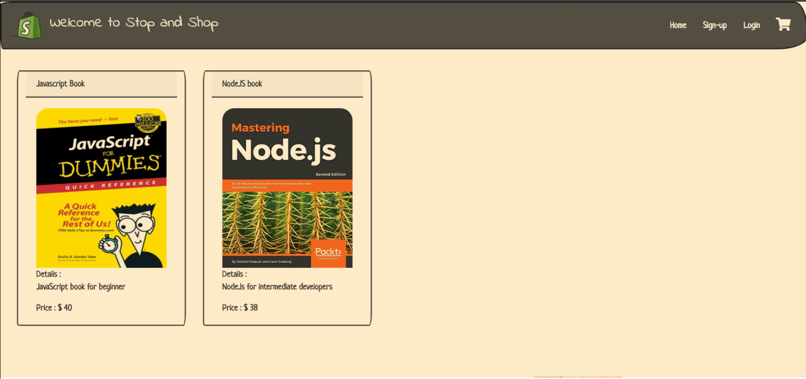
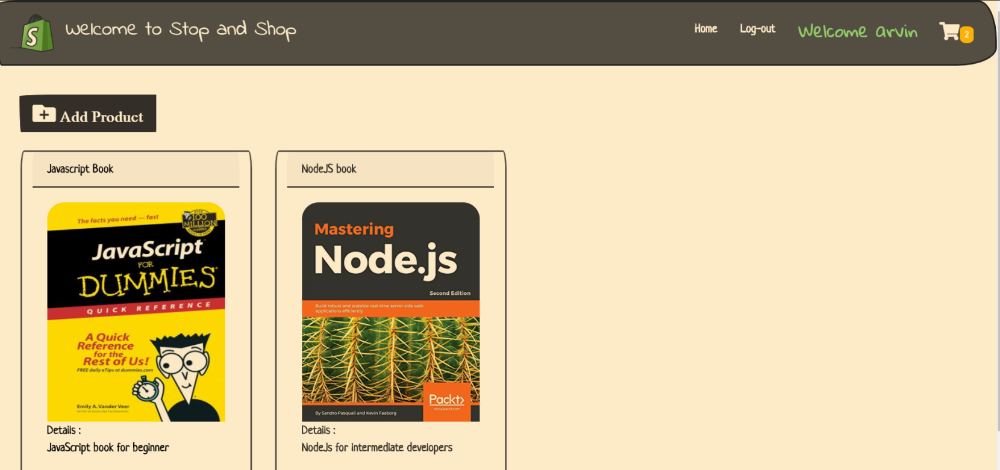
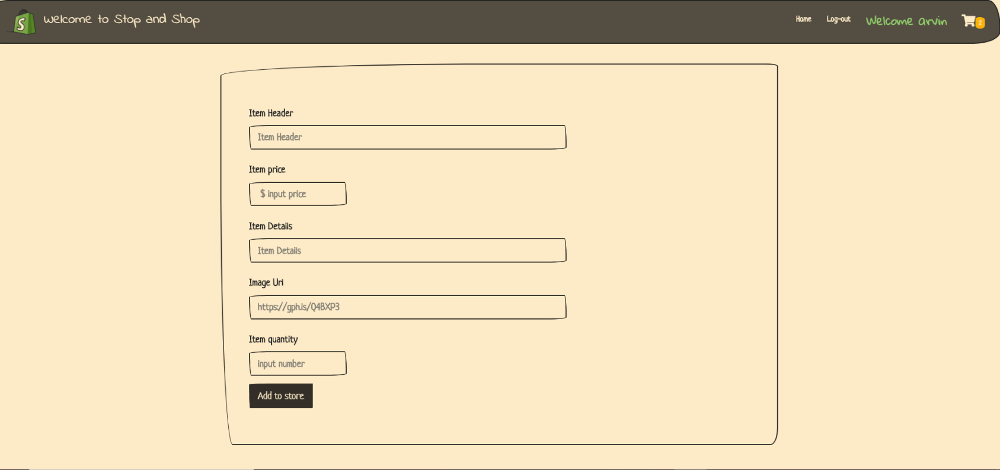
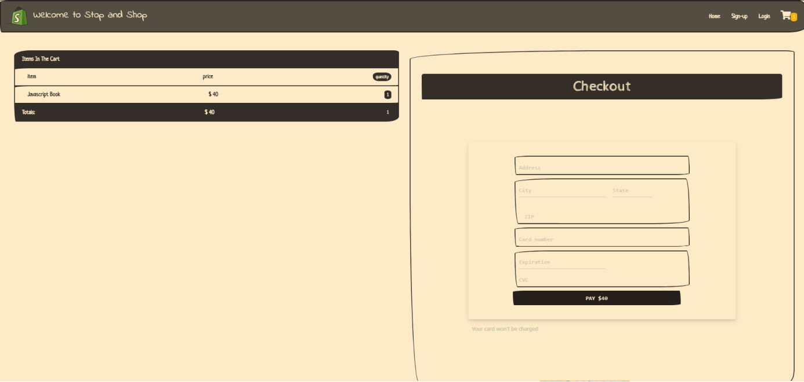

# Stop And Shop

Stop and shop is online local store application that allow users buy products from online store . On the main page users can see a list of item for sale in store by clicking on each item its take you to another page with item informations and there you will be able to add an item to your shopping cart. After users finish with adding item to their shopping cart they will be able to go to the shopping cart and they will see a list of items they chose and they can procede to checkout. After checkout process the shopping cart will be empty and its take them back to the main page. In this application users will be able to sign-up and login to their account. This application has functionality for Admin to add more items to the store.

## How this app looks like ?

 #### Main page 

#### Admin page 

#### Add new product 

 

 #### Checkout page

## Prerequisites

To run this application locally after you clone this Repository you need to run `npm install` / `npm i` in your terminal.That install all dependencies.

## Built With

        Nodejs, Express.JS, Sequelize, express-handlebars, MySQL, HTML, CSS, Bootswatch, JavaScript,jQuery, Passport, Stripe client API    

## Authors

- Arvin mahmoudi    https://github.com/arvin-m
- Scotty Mikul      https://github.com/ScottMikul

## Live system link :

  https://stop-and-shop-2020.herokuapp.com/

## Future Enhancements 

- Allow admin to upload an image for the product they are creating.
- Send an email to the client to verify an email address
- Process real stripe transactions
- Order History
- Delivery Options (we just keep the money right now)

